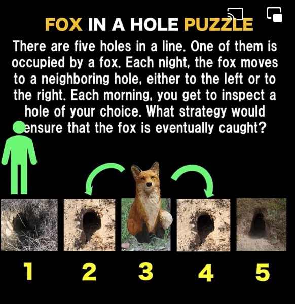
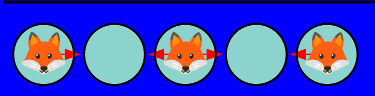
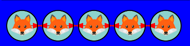
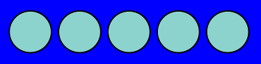
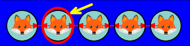
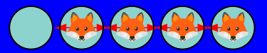
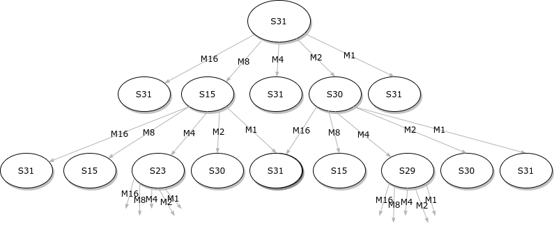
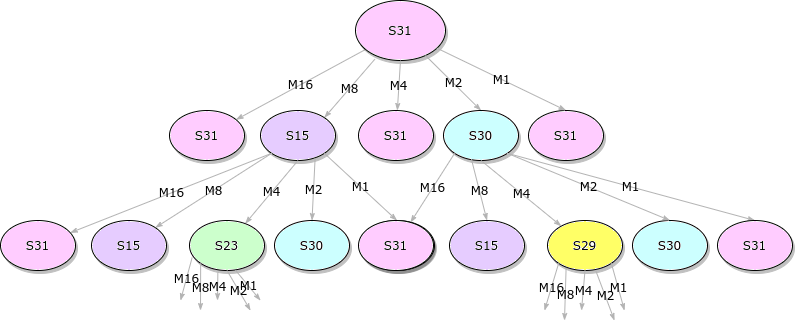
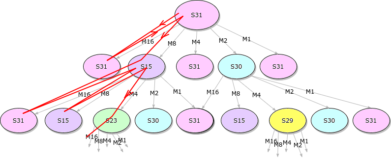
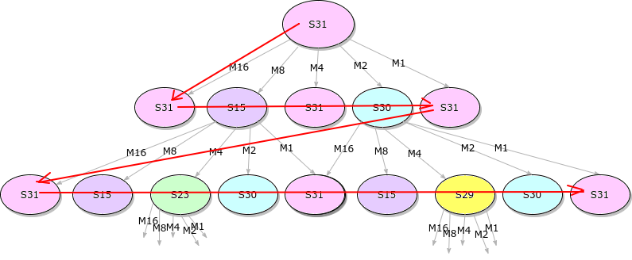

# Foxholes Solver
## Synopsis
### The foxholes game


The Foxhole game is well described above. The original game has 5 holes in a row, with one hole "visited" (and fox caught) per day.

The goal is to capture the fox, no matter how wily, as long as the fox follows the rule to move every night.
 
### Playing the game

You can play the game [online](https://github.com/alfille/foxholes.github.io).

### Elaborations

Once you figure out how to solve the original game (hint, use the edges) the natural question is what happens if you change the rules?

#### Game harder
* **Length** Lengthen the line of holes
* **Width** Add more holes in width
* **Geometry** Change to a circle or triangle arrangement
* **Connections** Let the foxes jump 6 or 8 ways instead of only 4

#### Solution easier
* More hole **Visits** per day
* **Poison** the holes after a visit to make them uninhabitable for some number of days

All these choices are available in the solvers, and the [online game](https://github.com/alfille/foxholes.github.io).
  
### Solver
The purpose of this set of programs is to automatically find a winning strategy for a particular Foxhole game setup, or determine that it is not solvable. 

The solution can be downloaded to a file that can be loaded into the [online game](https://github.com/alfille/foxholes.github.io) to view in a web browser.

## Game model

The game course is making a number of moves (inspecting holes) to counteract the foxes' moves. You and the foxes alternate:

**State -> Move -> State -> ...**

where **State** is the state of all the foxholes after the foxes have moved and **Move** is all the hole inspections on a given day.

### Game state

A **Game State** can be represented like this:



This shows potential foxes in 2 of the holes.

For simplicity we can call this Game State:

**0 1 0 1 0** where foxes are 1 and empty holes are 0. This looks like a binary number corresponding to 10 in decimal, and we will take advantage of that binary representation.

So this is Game State **S10**
___

The Goal of the game is to go from Game State:


to Game State:


Or **1 1 1 1 1** -> **0 0 0 0 0**

Or S31 -> S0
___

*Actually S0 is shown as:*


*in the game to flag this as a win!*
___
Note that there are 
```
2^holes
``` 
number of Game States (`2^5 = 32`	 in this case)

### Moves

Between each Game State, you can inspect up to **visits** number of holes. For example:



This could also be represented in binary:

**0 1 0 0 0** or **M8**
___

The number of possible moves is the
*binomial coefficient*:

`B( holes, visits )` = holes!/(visits!*(holes-visits)!)

### Game representation

A example game start:

State: 

Move: 

to State 

can be representated as:  **S31 -> M8 -> S15**

## Searching
### Search tree


This is the top of a search tree.
* Starts from initial state (S31 in this case)
* Each move is applied to that state (independently)
* Resulting state starts a new tree
* Again all moves are tried on each state

### Search pruning
Note that some moves result in a state that was seen before. 
* The whole tree would be repeated infinitely at that point
* By only looking a new states, the size of the tree is finite

So the tree is **pruned** by stopping at all previously seen states

### Pruning storage
Keeping track of all previously seen states (for pruning) requires memory. 

Either:

* 1 bit for all possible states, or
* A list of seen states (sorted in some fashion for fast look-up) 

Since potential states is `2^holes` bitmap is practical up to ~32 holes, and larger games depend on a sparse set of states reached to limit memory demand.

### Search strategy

#### Depth-first


* Visits all nodes
* Least memory
* Easy to keep track of winning path
* No guarantee of shortest winning path

#### Breadth-first


* Visits all nodes
* Requires memory for each node on a given horizontal level (game day)
* Extra memory (or computation) for remembering winning path
* Guarantees shortest winning path

### Poison problems
One of the choices for a foxhole game design is adding some days of poisoning inspected holes, making them uninhabitable for foxes.

Unfortunately, poisoning for more than 1 day adds complexity to the Game State -- the Game position should include some days of extra history.

None of the solvers include multi-day poisoning in their Game State. So solutions found will be valid (especially for `fhsolve`) but may not be optimal. Nor will the search be exhaustive.

## Implementation
### Algorithms
* foxhole32_solver
  * Breadth first
  * Up to 32 holes
  * Game-states kept in comprehensive bitmap
  * Winning path by backsolving
* foxhole64_solver
  * Breadth first
  * Up to 64 holes
  * Game-states kept in sorted list
  * Winning path by back-solving
* fhsolve
  * Depth first
  * Up to 64 holes
  * Game-states kept in sorted list
  * Winning path kept in simple list

### bit-maps
Extensive use of bitmaps for calculations:
* Game states
* Moves list
* Fox jumps (by hole)

In addition, calculating the inspection and fox move is by bit arithmetic

### Backtracking
